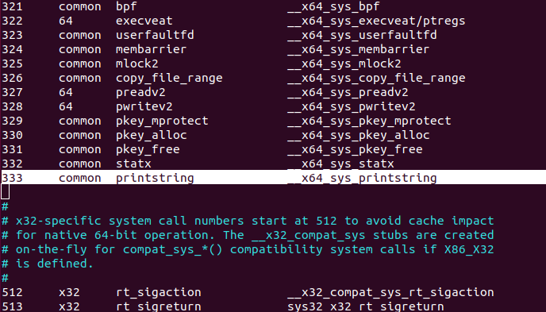
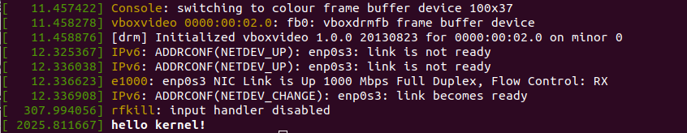

# Adding a System Call which can pass a userspace string
## under Ubuntu18.04 and kernel version 4.17.4
##### Ansley Lee

I have seen numerous tutorials that implement a simple system call, including:

https://medium.com/@ssreehari/implementing-a-system-call-in-linux-kernel-4-7-1-6f98250a8c38
https://medium.com/anubhav-shrimal/adding-a-hello-world-system-call-to-linux-kernel-dad32875872

But when it comes to passing arguments, especially strings, it involves the usage of  functions like copy_from_user() to correctly pass a userspace argument to kernel. And non of these tutorials has even mention about it. (Don't misunderstand me. They are still great tutorials.)

Luckly enough, one of my friend found this:

https://brennan.io/2016/11/14/kernel-dev-ep3/?fbclid=IwAR2l2IAwe_A7j8znXTkLiGEt628Yt1NsgMfqkLy_Oh72nyAYB1M30otmZwM

It built a system call that passes a userspace string to kernel, which is exactly what I wanted.

However, it uses an Arch Linux machine. With Ubuntu, I found that there are some things that need to be modified.

With lots of tests and errors, this is how I succeeded:

### 0. Setup
a. Download and unpackage kernel sources. You can find steps in other tutorials (including the links above).

b. **Switch to superuser** to exclude permission problems.

c. **Every relative path below are related to the main directory of the kernel**.

### 1. Add system call number to reference table
Add something like this in *arch/x86/entry/syscalls/syscall_64.tbl*:


The first column is the system call's number. Use a number that hasn't been used.

The second column says that this system call is common to both 32-bit and 64-bit CPUs.

The third column is the name of the system call. (As you can see, *printstring* is my system call's name.)

The fourth is the name of the function implementing it. Notice that since we're using SYSCALL_DEFINEn macro to implement the system call (see below), it will create the system call implementation with the prefix as the same as others (in this case, \_\_x86\_sys\_. Just add the same prefix that make it looks like others).

Use tabs when typesetting.

### 2. Implement system call

Use SYSCALL_DEFINEn macro to implement your system call.
You can either implement it in your own file or simply add it somewhere in kernel/sys.c .

Below I will create a file:

`mkdir printstring; cd printstring; touch printstring.c` 

And this is what the simple file looks like:
```c
#include <linux/kernel.h>
#include <linux/linkage.h>
#include <linux/syscalls.h>
#include <linux/uaccess.h>

/* function to print string to kernel */
/* syscall number 333 */

SYSCALL_DEFINE2(printstring,
		char __user *, src,
		int, len)
{
        char buf[256];
        unsigned long lenleft = len;
        unsigned long chunklen = sizeof(buf);

        while( lenleft > 0 ){
                if( lenleft < chunklen ) chunklen = lenleft;
                if( copy_from_user(buf, src, chunklen) ){
    		return -EFAULT;
    	}
                lenleft -= chunklen;
        }
    
        printk("%s\n", buf);
    
        return 0;
}
```


The copy_from_user() is the API for copy things from userspace to kernel. You can google to learn how to use it. You can also use strncpy_from_user() when passing strings, I guess.

Don't forget to add Makefile in the folder:

`touch Makefile`

And add

`obj-y:=printstring.o`

in Makefile.

Also add the directory to the kernel's Makefile (at main directory).

Find something like this in the file:

`core -y  += kernel/ mm/ fs/ ipc/ security/ crypto/ block/`

Add the directory that we created:

`core -y  += kernel/ mm/ fs/ ipc/ security/ crypto/ block/ printstring/`

(If you define your implementation in sys.c, you can skip the above steps.)

### 3. Compile kernel
We are now at the main directory of the kernel.

Install essential packages:

`sudo apt-get update`

`sudo apt-get install git fakeroot build-essential ncurses-dev xz-utils libssl-dev bc`

These might differ as time goes by. Just install the package that is missing if compiling failed because of this.

If this is your first time to comile:

`cp /boot/config-$(uname -r) .config`

`make menuconfig`

Don't change anything if you are not sure what this is.

Then:

`make -j 4 && make modules_install -j 4 && make install -j 4`

Argument `-j 4` specifies how many cores (4 in this case) you want to use when compiling. It might speed up your compile process.

It will take a while. Go watch a football game.

Then update your kernel when compiling is done.

If this is your first time to comile:

`update-initramfs -c -k 4.17.4`

If you have already compiled:

`update-initramfs -u`


Update grub:

`update-grub`


Reboot when done.

### 4. Test system call
Run a simple C with syscall() function to test it:

The C file:
```
#define _GNU_SOURCE
#include <unistd.h>
#include <stdio.h>
#include <stdlib.h>
#include <errno.h>
#include <sys/syscall.h>
#include <string.h>

int main(void){
	
    char st[256];
    sprintf(st, "hello kernel!");
    
    long sta = syscall(333, st, 20);
    //I type 20 simply because I don't want to do any math now

    printf("return value from syscall: %ld\n", sta);

    return 0;
}
```

Compile and run it:

`gcc test.c -o test`

`./test`


You'll see your string with dmesg:

`dmesg`




And syscall returns 0, meaning you have succeeded.

Congrats!

## Conclusion
I am not an expert. If anything goes wrong while you're doing this, please, go search the internet or ask StackOverflow XD.
