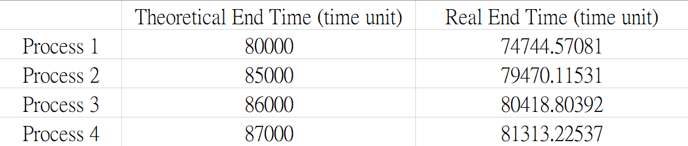
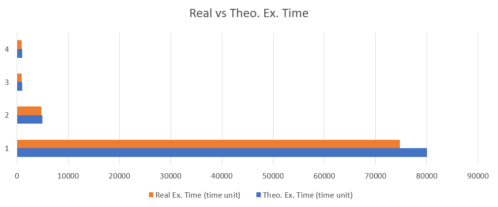
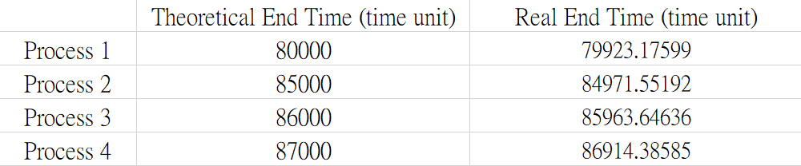

## Testing Environment is the Cause of  Differences between Actual Outputs and Theoretical Outputs

#### Outcome

We know that inaccuracy were inevitable because of other processes' disturbance, CPU properties and scheduling policies, and other numerous reasons. These factors are parts of the testing environment.

In our tests, we noticed that there are some "big ones" that resulted in our actual outcome data, meaning that the scale of difference, actual output divided by theoretical output, went up to around 10%. These faults seems to show failure in our test results. However, we will show you that, it is **still these environment factors** that cause the inaccuracies.

#### Independence of Process Execution Time

Let us consider one of the experiments that we have done on FIFO_2:

Plotting the *real vs theoretical execution time* bar graph from the above form:

In the above graph, we can see that the real execution time diverges from the theoretical one when time grows, and it seems that there is a correlation between *difference* and *execution time*. 

Nevertheless, if we plot the real divergence in percentage ( difference / (Theo. Ex. time) * 100% ):

We can see that there are no actual correlation between divergence and execution time. Also, we noticed that the difference rate at any given execution time are similar. The key thing is, we are using the average execution time of a particular test case to measure a time unit. This leads to a reasonable assumption: we are using the wrong time unit. In other words: *The time unit that we use for testing is not a suitable one in the testing environment **at the time we are testing.***

Another experiment conducted at a different time on the same input (FIFO_2) supports this idea:

The above experiment is much more accurate, and there are no modifications between these two experiments. The only thing changed is the environment. Thus we have proved our main idea: *Testing Environment is the Cause of  Differences between Actual Outputs and Theoretical Outputs.*

